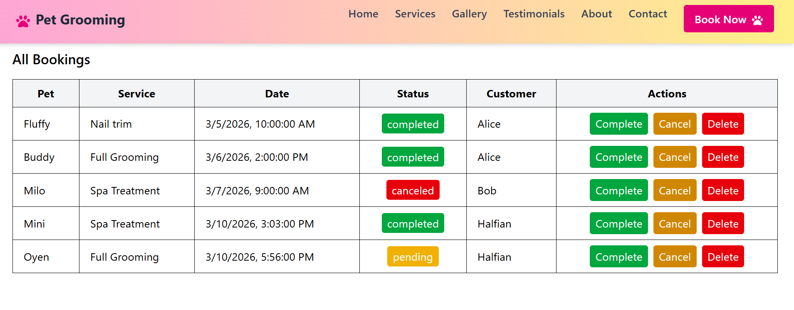
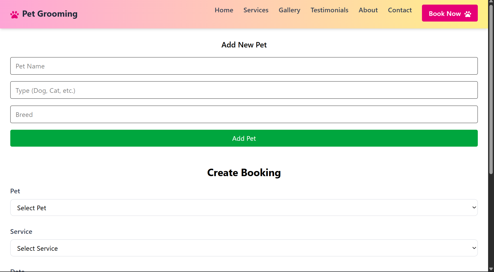
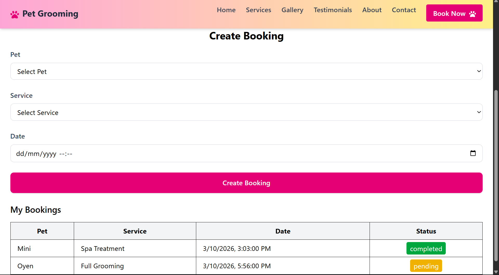

## Pet Grooming Booking App
Pet Grooming Booking App helps pet owners easily schedule grooming services online, while giving admins tools to manage bookings and customer data.

---

## ✨ Features
- Role‑based authentication (customer/admin)
- Secure login with JWT + bcrypt
- Add pets or choose recorded pet details
- Create bookings linked to pets and services
- Admin dashboard for managing bookings
- Responsive UI built with TailwindCSS

---

## 🛠 Tech Stack


- **Frontend:** React, Vite, TailwindCSS, Zustand  
- **Backend:** Node.js, Express, PostgreSQL  
- **Auth:** JWT with bcrypt password hashing  

---

## Setup Instruction
1. Clone the repo
   ```bash
   - git clone https://github.com/Halfian/pet-grooming.git
   - cd pet-grooming
2. Install dependencies
   - npm install
3. Configure environment variable
   Copy .env.example to .env and update values with your own credentials (PostgreSQL and JWT values).
4. Run in development
   npm start (starts backend + frontend concurrently)

---

## Live Demo
https://halfian.github.io/pet-grooming/

---

## Screenshot
- Admin Page
  
- Booking Form
  
  

---

## Deployment
Frontend hosted on GitHub Pages, backend deployed with Neon + Vercel. CI/CD via GitHub Actions.

---

## Future Improvements
- Payment integration
- Email notifications for bookings
- Admin analytics dashboard